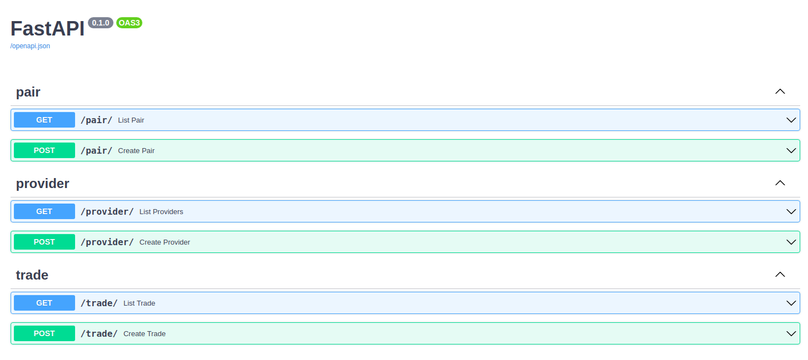
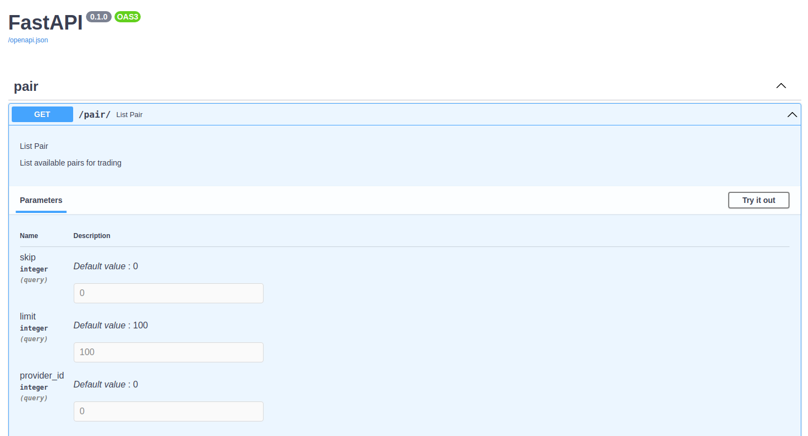

# Market Data API

This is a Fast API lightweight application to create and list market's data.

## Requirements

To make this run you must have installed:

* docker
* docker-compose

## First build

The first build will take longer if it needs to download the base images (python and postgres)

```bash
make build
```

## Running application

The application will be available on [http://localhost:8000](http://localhost:8000)

```bash
make start-local
```

## Initial migrations

This command will create tables

```bash
make migrate
```

## Loading initial data

Use this command to generate fake data

```bash
make load-data *qty*
```

* `qty`: should be the number of how many items do you want to create

## Stopping application

Containers will run on background. Whenever you want to stop them, you should enter this command

```bash
make stop
```

## Local bash

To access application command line terminal, you use local-bash:

```bash
make local-bash
```

## Tests

To run tests just:

```bash
make pytest
```

## Logs

If you want to check what is going on reading logs:

```bash
make logs
```

## Documentation

You can access documentation with endpoints details:

- Swagger interface: [http://localhost:8000/docs](http://localhost:8000/docs)
- ReDoc interface: [http://localhost:8000/redoc](http://localhost:8000/redoc)

### Swagger screenshots





- `Note`: Clicking on "Try it out" (screenshot 2) you can send request to the endpoint

### ReDoc screenshots


